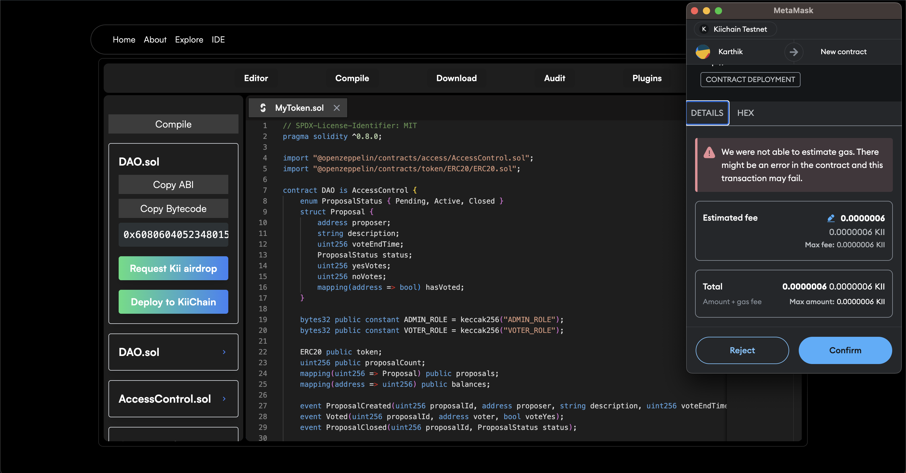

 
  

<h1 align="center"> 
    Arc
</h1>
<h3 align="center"> 
    
</h3>

  

    <a href="">View Demo</a>
    ·
    <a href="">Contact us</a>
    ·
    <a href="https://github.com/karthiks373/arc/issues">Request Feature</a>
  

## Table of contents 

- [Introduction](#introduction)
  - [Mission](#mission)
  - [Core](#core)
  - [Features](#features)
  - [Concepts](#concepts)
  - [Value Proposition](#value)
  - [Tech stack](#tech)
- [Motivation](#motivation)
- [Installation](#installation)
- [Project Gallery](#gallery)
- [Contributors](#contributors)

## Introduction 

Welcome to Arc, a versatile and production ready smart contract engine that redefines the experience of a smart contract developer. Arc combines exceptional speed, security and intelligence to provide a seamless experience develop, audit and deploy smart contracts. Arc combines powerful tools inspired by Remix, Third Web and OpenZeppelin Wizard enhanced by a finely-tuned AI model to elevate every stage of the development process. With Arc, developers can streamline the entire contract development lifecycle and fasttrack their development journey. Drawing inspiration from leading blockchain development frameworks, Arc not only simplifies complex tasks but also enhances the precision and quality of the smart contracts

### Mission 

Our mission with Arc is to democratize smart contract development on Kiichain by making the process more accessible, secure and efficient for everyone

### Core 

### Features 

Arc is packed with a wide array of features designed to enhance every aspect of smart contract development.
Here is a detailed breakdown:

#### 1. **AI powered IDE**

Arc provides an intelligent development environment for solidity where you can write smart contracts from scratch or use pre-built templates. The AI-driven autocompletion suggests code as you type, speeding up the process and reducing errors

#### 2. **1000+ prebuilt and audited templates**

Start with secure, pre built smart contract templates (collected from different sources) that have been thoroughly audited. These templates offer a robust foundation, saving time and effort while ensuring reliability

#### 3. **Custom Compiler**

Arc’s custom compiler supports dynamic import resolution, allowing for seamless management of external dependencies and libraries. It also handles multi-file compilation, making it easy to work with complex contracts that span multiple files

 

#### 4. **AI powered vulnerability checking**

Security is a top priority with Arc. The platform uses advanced AI to analyze the smart contract code in real time, identifying potential vulnerabilities and suggesting fixes to ensure robust and secure contracts

#### 5. **AI plugins**

Automatically generate detailed documentation for your smart contracts using Arc’s AI plugin. This feature provides comprehensive explanations and makes your code easier to understand and maintain.

#### 6. **Chat with contract**

Interact with your smart contract through a conversational AI interface. You can ask questions to understand specific functions, explore use cases or troubleshoot issues enhancing your understanding of complex contracts

#### 7. **Explain contract**

Use the "Explain Contract" tool to receive high level or detailed explanations of your smart contract. This feature helps demystify the functionality and components of your contract, making it easier to grasp and review

#### 8. **Code auditing**

Arc has two modes of auditing AI powered checks and using static analysis tools that assess your smart contract against adding an extra layer of security and ensures comprehensive vulnerability detection

#### 9. **Downloade contracts in multiple formats**

After developing your contract, Arc allows to download it in various formats such as Zip, Hardhat or Foundry templates. Users can also copy the contract code directly to the clipboard for immediate use

 

#### 10. **One click deployment**

Deploy your smart contract to the `Kiichain testnet` with a single click. Arc integrates wallet support and configuration for effortless deployment, removing the need for complex setups or manual configurations

 

 

 

 

#### 11. **Contract ABI and bytecode extraction**

Quickly generate and download the ABI (Application Binary Interface) and bytecode for the smart contract. This feature facilitates integration with front-end applications and other blockchain components

#### 12. **Testnet faucet**

Arc includes an integrated faucet for obtaining testnet tokens, ensuring you have the resources needed for testing your contracts on the Kiichain testnet

#### 13. **Contract management dashboard**

Arc helps to manage and visualize all the contracts with it's intuitive dashboard where users can track the contract statuses, interact with them and make necessary modifications through a user-friendly interface

#### 14. **Web resource search**

Arc utilizes the AI plugin to search for relevant web resources related to your smart contract helping users find documentation, tutorials and other resources that can assist in your development process

#### 15. Decode a transaction with AI explanation

Decode a transaction (and AI explanation) to understand the details of the transaction, including the input data, output data and other relevant information helping users to analyze and troubleshoot transactions more effectively

### Concepts 

- [Training deep learning model for smart contract vulnerability detection](./docs/ResNet.md)
- [Enhanced problem detection and fixing using Gemini](./docs/Gemini.md)

### Value Proposition 

Arc aims to transform the way developers interact with smart contracts by providing a comprehensive suite of tools that streamline and enhance the development process. Our platform is designed to:

- **Increase Productivity**: By offering AI powered autocompletion, prebuilt templates and a custom compiler, Arc helps developers write, test and deploy smart contracts faster and more efficiently

- **Enhance Security**: With advanced AI powered vulnerability checking and code auditing, Arc ensures that smart contracts are secure and resilient against potential threats

- **Simplify Complexity**: The AI driven documentation and explanation tools make complex contracts easier to understand and maintain, reducing the learning curve and improving overall code quality

- **Streamline Deployment**: The one click deployment feature simplifies the process of deploying contracts to the Kiichain testnet, removing the need for manual configurations and setup

- **Facilitate Integration**: By providing ABI and bytecode extraction, Arc makes it easy to integrate smart contracts with front-end applications and other blockchain components

### Tech stack 

Arc is built using a robust tech stack to ensure performance, reliability, and scalability:

- Next.js
- Solidity
- Slither
- Hardhat
- Foundry
- AI models

[ <a href="#table-of-contents">↑ Back to top ↑</a> ]

## Motivation 

The motivation behind Arc is to address the common challenges faced by smart contract developers, such as security vulnerabilities, complexity of development, and inefficiencies in the deployment process. By leveraging advanced AI and providing a comprehensive suite of tools, Arc aims to make smart contract development more accessible, secure, and efficient, ultimately fostering innovation and growth within the blockchain ecosystem

[ <a href="#table-of-contents">↑ Back to top ↑</a> ]

## Installation 

[ <a href="#table-of-contents">↑ Back to top ↑</a> ]

## Project Gallery 

[ <a href="#table-of-contents">↑ Back to top ↑</a> ]

## Contributors 
